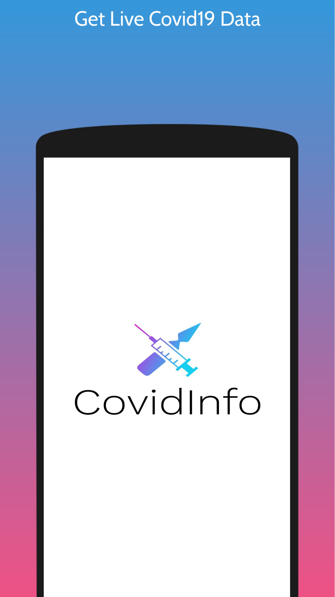
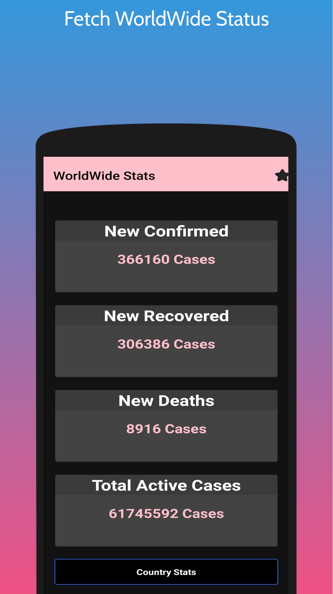
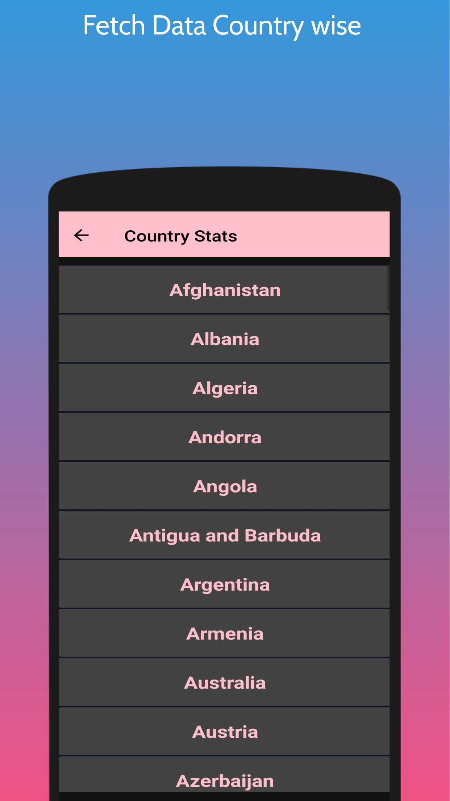

  

## :calling: About

CovidInfo is a React Native app which provides real time Covid-19 data for each country with the help of Postman API.

## :eyes: Preview

### :1234: Instructions to Preview (_iOS users, see note below_)

1. Head over to the Google Play Store and download the Expo Go app

   - Link: https://play.google.com/store/apps/details?id=host.exp.exponent

2. Open the [Expo Go](https://play.google.com/store/apps/details?id=host.exp.exponent 'Expo Go') app or simply go to the [Expo website](https://expo.io/ 'Expo') and follow the instructions to register for an Expo account

   - Note: _**You will need an account on Expo in order to view the app!**_

3. After completing step 1 and 2 above, open your device camera and scan the provided QR code in the link below:

   - Link: https://expo.io/@idontknow1214/CovidInfo (_**Published version of app hosted on Expo**_)

4. After scanning the QR code, the Expo Go app will automatically load up the app

   - Note: _**If this is your first time opening the app, it might take a while to load up. Please be patient!**_

### :bangbang: IMPORTANT! - _Note for iOS users_

Unfortunately, iOS users will not be able to preview the published app hosted on Expo. This issue is due to restrictions imposed by Apple and not by Expo itself.

Please refer to this Expo documentation link for further information on this restriction:

- Link: https://docs.expo.io/workflow/publishing/#on-ios-you-cant-share-your-published

Due to the nature of this project objective being an educational and experimental one in learning more about working with [React Native](https://reactnative.dev/ 'React Native') and the [Expo](https://expo.io/ 'Expo') framework in a production-like environment mimicking a professional workflow, this app isn't built for distributing officially to either the [Play Store](https://play.google.com/store 'Google Play Store') or the [App Store](https://www.apple.com/app-store/ 'App Store').

For this, please refer to the app screenshots below. A mixture of both screenshot pictures and GIFs is provided as an alternative for previewing the app.
### APK - https://www.mediafire.com/file/l3jjvk4rx50plx4/CovidInfo-72f3a7256a7741b7802ffd1f5fb5aaf5-signed.apk/file
## :gear: Core Tech Stack
- :arrow_up_small:&nbsp; [Expo](https://expo.io/ 'Expo')
- :electron:&nbsp;[React Native](https://reactnative.dev/ 'React Native')
- 🐱&nbsp; [Kitten UI](https://akveo.github.io/react-native-ui-kitten/)
- :link:&nbsp; [React Navigation](https://reactnavigation.org/ 'React Navigation')
- 🏣&nbsp; [Postman COVID19 API](https://documenter.getpostman.com/view/10808728/SzS8rjbc)

## :sparkles: Main Features

- Get Real-Time Covid-19 Data
- Get Seperate Data For Each Country

## :camera_flash: Screenshots

    
    
    

## :memo: License 

This project is under the terms of the GNU GPL v3 license. For more information, please refer to the license [documentation](LICENSE.md).

## :warning: Disclaimer

The contents of these pages are provided as an information guide only. While every effort is made in preparing the material for publication, no responsibility is accepted by or on behalf of the owner(s) for any errors, omissions or misleading statements on these pages or any site to which these pages connect. Although every effort is made to ensure the reliability of listed sites this cannot be taken as an endorsement of these sites.
